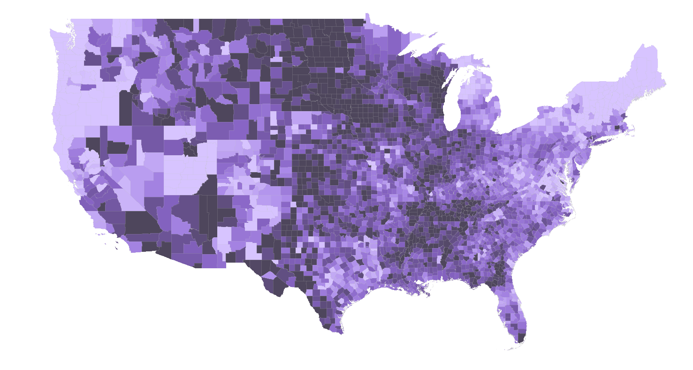

# The Masked Politic


**Project Contributors**:  Joseph Marx, Steven Yan

## Business Proposal:
- This project has been structured as a pitch to political analysts to fund a large scale survey of mask wearing habits. We intend to show a strong correlation between mask wearing in a given county and how the people of that county voted in the 2020 presidential election. Since the dataset we have to work with is limited to a proportion of counties in the nation, we are unable to test our model on the whole country, but with more resources to gather county-level data, we may be able to build an even stronger model and predict voting habits with greater accuracy than with traditional modeling features

## Background:

This project began as an attempt to build a classification model that would predict the 2020 Presidential election results for each county. 

This project launched out of an exploration into two topics: COVID-19 and the 2020 US Presidential Election. In exploration we looked into different aspects of society that COVID impacts, ranging from issues such as governance (i.e. declarations of state of emergencies and lockdowns), race (i.e. racial disparities in cases and deaths, access to healthcare and testing), economy (i.e. impact on food supply, impact on manfucturing, education, service, hospitality due to social distancing), public health measures (i.e. mask mandates, testing and contact tracing, vaccination rollout).  Each of these can be explored on an international, national, state, and/or a county level depending on the availability of information, which is generally limited to studies and their requisite funding. For the most part, due to the urgency of the issue and panglobal impact of the virus, it is in every nation's to share information.

As we sifted through different datasets, we found a mask wearing study conducted by New York Times. The image below illustrates what the data is able to demonstrate, which is by county an estimate of the likelihood you would encounter someone wearing a mask in the next 5 encounters based on a survey conducted back in July:


While this dataset provides data on every county in the United States, this dataset only provides a snapshot at one very specific time of every county in the United States.  There is a study being conducted by Carnegie Mellon, facilitated by Facebook that captures ongoing county-level data about, among other things, mask-wearing data. (It is worth noting the data is only from the subset of individuals that use Facebook as a social platform, and are also would be willing to complete a survey about COVID-19. All models built therefrom have a built in assumption that the data weighted by the study facilitators appropriately accounts for this sampling method.)


In parallel to this we looked through election data, interested in ways the results could be modeled. It was hypothesized that there is a correlation between how a person votes and their compliance with CDC and local health ordinances for wearing masks and social distancing. It became the objective of this project to be able to model that relationship through combining the datasets we had been exploring.

## Modeling Process
After performing exploratory data analysis, the data we sourced required a bit of reconfiguring to appropriately merge, clean, and feature engineer. Data imputation was first attempted to see if a model could be built without collection more county-level data, but this proved inneffective since the available counties surveyed were both not randomly sampled and a minority of total counties.

To test our hypothesis, we modeled in parallel a dataset with features conventionally used to predict on voting habits, and then a dataset with those baseline features plus the mask compliance data from the Carnegie Mellon study. Several classication models were used, with evaluation metrics available to allow for comparison of performance.

## Analysis and next steps:
There is an improvement in model scoring metrics when including community mask habit features. The consistency of model improvement suggests that this data is worthwhile to gather for anyone interested in being able to model the 2020 election. With a dataset pipeline providing up-to-date data for each county in the country, a full model could be built and tested. If the pandemic is still active in 2022, the model could then be tested for predictive power in future elections as well.

## Folder Structure:
```
├── README.md                           <- The top-level README for reviewers of this project
├── Phase_3_Project.ipynb               <- Notebook for Data Cleaning, Exploratory Data Analysis, Feature Engineering, and Feature Selection
├── modeling_notebook.ipynb             <- notebook containing all elements of model
├── data                                <- dataset files
└── images                              <- Both sourced externally and generated from code
```

## Questions:
Joe Marx—jmarx@hash.fyi
- <a href='https://www.linkedin.com/in/joe-marx-260a64102/'>Joseph Marx</a>
Steven Yan—stevenyan@uchicago.edu
- <a href='https://www.linkedin.com/in/examsherpa/'>Steven Yan</a>

## Sources

Data from Delphi COVIDcast. Obtained via the Delphi Epidata API. 
https://cmu-delphi.github.io/delphi-epidata/api/covidcast.html

Data from US Department of Agriculture 
https://www.ers.usda.gov/data-products/rural-urban-continuum-codes/documentation/#referencedate

Data from Kaggle
https://www.kaggle.com/etsc9287/2020-general-election-polls

Data from ArcGIS:
https://opendata.arcgis.com/datasets/4cb598ae041348fb92270f102a6783cb_0.geojson

